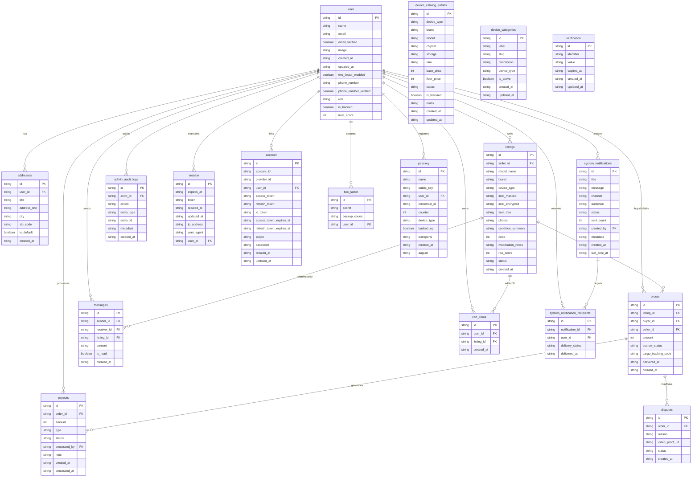

This is a [Next.js](https://nextjs.org) project bootstrapped with [`create-next-app`](https://nextjs.org/docs/app/api-reference/cli/create-next-app).

## Getting Started

First, run the development server:

```bash
npm run dev
# or
yarn dev
# or
pnpm dev
# or
bun dev
```

Open [http://localhost:3000](http://localhost:3000) with your browser to see the result.

You can start editing the page by modifying `app/page.tsx`. The page auto-updates as you edit the file.

This project uses [`next/font`](https://nextjs.org/docs/app/building-your-application/optimizing/fonts) to automatically optimize and load [Geist](https://vercel.com/font), a new font family for Vercel.

## Learn More

To learn more about Next.js, take a look at the following resources:

- [Next.js Documentation](https://nextjs.org/docs) - learn about Next.js features and API.
- [Learn Next.js](https://nextjs.org/learn) - an interactive Next.js tutorial.

You can check out [the Next.js GitHub repository](https://github.com/vercel/next.js) - your feedback and contributions are welcome!

## Deploy on Vercel

The easiest way to deploy your Next.js app is to use the [Vercel Platform](https://vercel.com/new?utm_medium=default-template&filter=next.js&utm_source=create-next-app&utm_campaign=create-next-app-readme) from the creators of Next.js.

Check out our [Next.js deployment documentation](https://nextjs.org/docs/app/building-your-application/deploying) for more details.

## Environment Variables

### Twilio OTP delivery

The Better-Auth 2FA and phone login flows send OTPs through Twilio. Configure the following variables in your `.env` file:

```
TWILIO_ACCOUNT_SID=ACxxxxxxxxxxxxxxxxxxxxxxxxxxxxx
TWILIO_AUTH_TOKEN=your_auth_token
TWILIO_WHATSAPP_FROM=whatsapp:+14155238886   # sandbox sender; keep whatsapp: prefix
TWILIO_SMS_FROM=+1xxxxxxxxxx                # optional, required for SMS channel
TWILIO_DEFAULT_CHANNEL=whatsapp             # or sms
```

`TWILIO_DEFAULT_CHANNEL` lets you pick whether OTPs default to WhatsApp or SMS. When using WhatsApp, pass bare phone numbers (e.g. `+994...`); the app automatically applies the `whatsapp:` prefix.

## Admin Panel Access

The `/admin` routes are protected by `requireAdminSession()`.

1. Assign yourself an elevated role by updating `user.role` to `admin` (or `moderator`) in the database, **or** add your email to `NEXT_PUBLIC_ADMIN_EMAILS` (comma-separated list, lowercase) and redeploy.
2. Sign in normally. After Better-Auth issues a session, visit `/admin`—the guard looks at both the persisted role and the env override list.
3. To remove access, revert the role to `user` or delete the email from the env variable and recycle the server.

## WhatsApp OTP Notifications

`src/lib/notification-service.ts` wraps Twilio's WhatsApp API. All Better-Auth OTP flows (`twoFactor`, `phoneNumber`) now call `notificationService.sendOtp`, which:

- Normalizes the destination to WhatsApp by default (still supports SMS fallback).
- Generates short, localized copy for login, phone verification, and 2FA intents.
- Keeps Twilio credentials and routing inside `src/lib/twilio.ts` so other notifications (e.g., admin broadcasts) can reuse the same transport.

## Data Model (Mermaid ERD)


